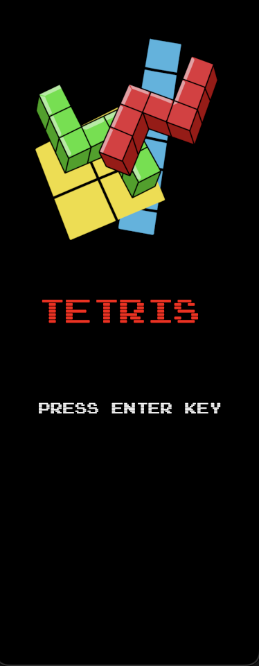
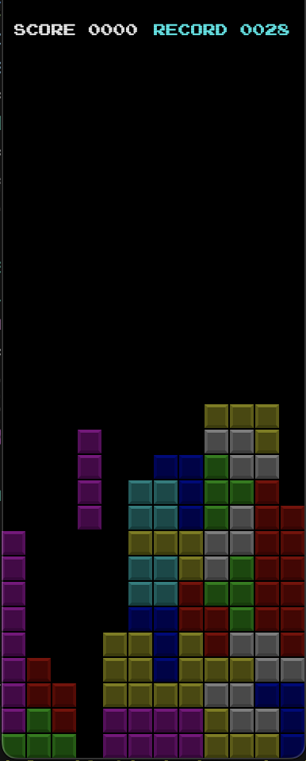

# Tetris
This is a fun and challenging block puzzle game built with rust and the ggez game engine.

> In Tetris, players complete lines by moving differently shaped pieces (tetrominoes), which descend onto the playing field. The completed lines disappear and grant the player points, and the player can proceed to fill the vacated spaces. The game ends when the uncleared lines reach the top of the playing field. The longer the player can delay this outcome, the higher their score will be

## Features 

- Background music.
- Move and rotate tetrominoes with the arrow keys.
- You can quickly drop the block by holding the down arrow key.
- Instructions on how to create a installer for mac operating systems.
- You can pause the game.
- Cloud storage of record score and current score display.

## :video_game: Controls 

- Rotate and move the tetromino around by pressing arrows.
- `P` key to pause and resume the game.
- Escape key to close the game.

## Screenshots

<p align="center">
  
  
</p>

### How to run it locally :question:

First make sure you create a `.env`following the format outlined in the `.env_sample`file.
Go ahead and create a new realtime database on firebase with the `score` node. The format should be:

```shell
{
  "score": {
    "value": 0
  }
}
```

The database rules should be defined this way:

```shell
{
  "rules": {
    ".read": "auth != null",
    ".write": false
  }
}
```
Once you have everything setup, update your `.env`.
Then run the following commands on the terminal:

```shell
foo@bar:~$ git clone https://github.com/eiberham/tetris.git
foo@bar:~$ cd tetris
foo@bar:~$ cargo run
```

### Create an installer for mac

This is the way I managed to build the app's bundle and create a `.dmg` file, following the [documentation](https://developer.apple.com/library/archive/documentation/CoreFoundation/Conceptual/CFBundles/BundleTypes/BundleTypes.html#//apple_ref/doc/uid/20001119-110730) you can get an idea of how the bundle folder structure is.

Simply run the `build.sh` script within the `src/scripts` folder, you'll get a `.dmg` file within the macos folder:

```shell
foo@bar:~$ cd tetris
foo@bar:~$ sh src/scripts/build.sh
```


